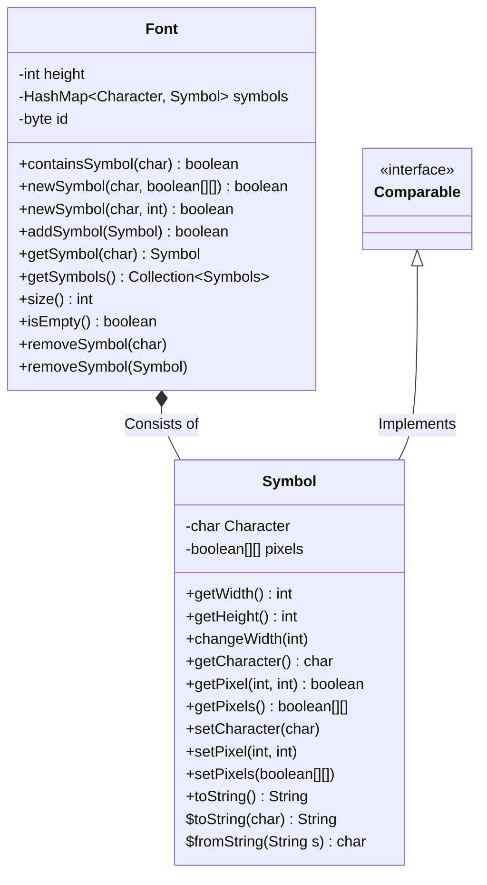
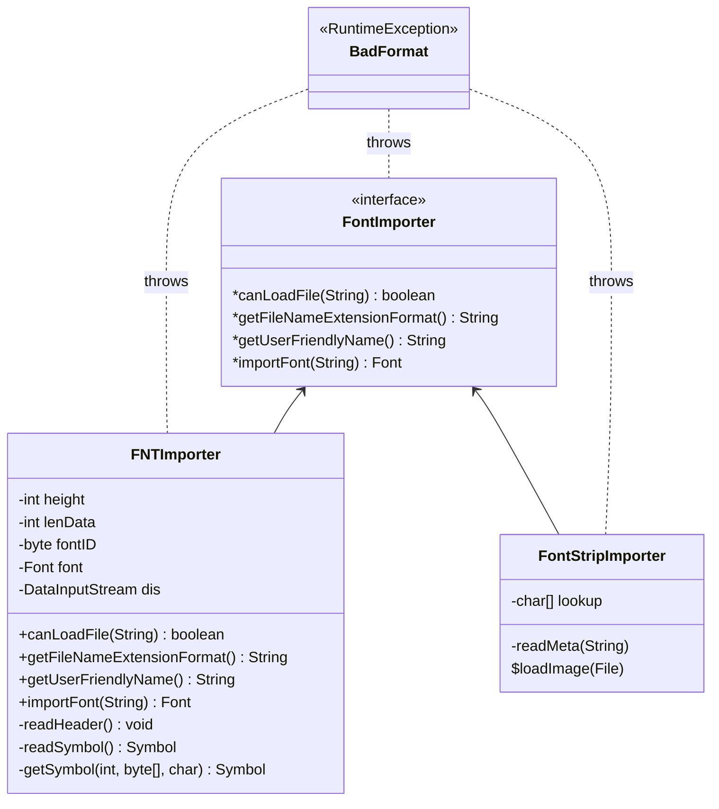
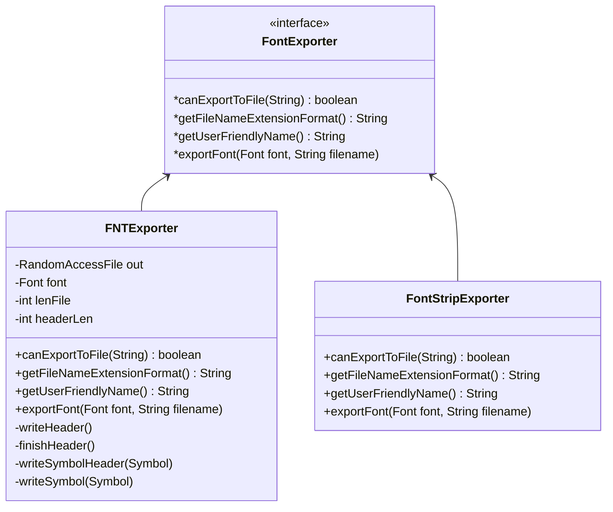
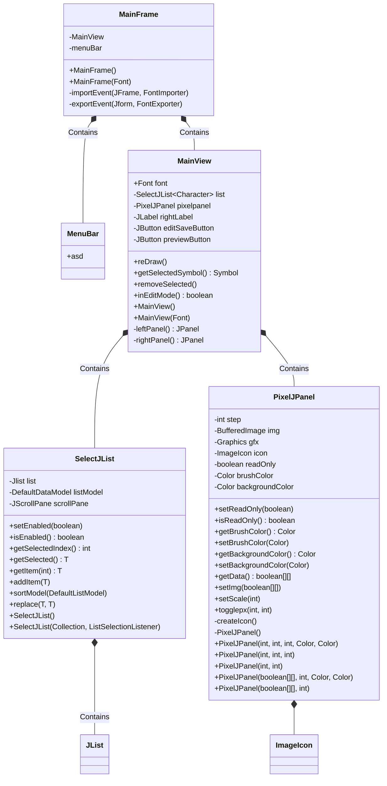

# FNTManager - FNT Font file manager - Developer's documentation

## Table of Contents

<!-- @import "[TOC]" {cmd="toc" depthFrom=2 depthTo=3 orderedList=false} -->

<!-- code_chunk_output -->

- [Table of Contents](#table-of-contents)
- [Legal & License](#legal--license)
- [Introduction](#introduction)
- [Internal data Structure](#internal-data-structure)
  - [Font and Symbol](#font-and-symbol)
  - [Importers](#importers)
  - [Exporters](#exporters)
- [Service Loaders](#service-loaders)
- [Command Line Interface](#command-line-interface)
- [UI Components](#ui-components)
  - [MainFrame and View overview](#mainframe-and-view-overview)
  - [MainFrame](#mainframe)
  - [MainView](#mainview)
  - [SelectJList](#selectjlist)
  - [PixelJPanel](#pixeljpanel)
  - [Preview and About frame](#preview-and-about-frame)
  - [Multi Input Dialog](#multi-input-dialog)
- [Utility classes in `com.zsotroav.util`](#utility-classes-in-comzsotroavutil)
  - [BitTurmix](#bitturmix)
  - [Tuple](#tuple)
- [Function Index](#function-index)

<!-- /code_chunk_output -->


<div class="page"></div>

## Legal & License

Copyright (c) 2023 Zsombor Török

This program is free software: you can redistribute it and/or modify it under the terms of the GNU General Public License as published by the Free Software Foundation, either version 3 of the License, or (at your option) any later version.

This program is distributed in the hope that it will be useful, but WITHOUT ANY WARRANTY; without even the implied warranty of MERCHANTABILITY or FITNESS FOR A PARTICULAR PURPOSE. See the GNU General Public License for more details.

You should have received a copy of the GNU General Public License along with this program. If not, see http://www.gnu.org/licenses/.

## Introduction

FNTManager is a fixed-height pixel font manager primarily designed for working with `.fnt` files, but designed in a modular and expandable way.

This developer's documentation is only a complementary resource to the already documented source code.

## Internal data Structure

### Font and Symbol
> Defined in [`com.zsotroav.FNTManager.Font.Font.java`](../src/com/zsotroav/FNTManager/Font/Font.java) and [`com.zsotroav.FNTManager.Font.Symbol.java`](../src/com/zsotroav/FNTManager/Font/Symbol.java)


### Importers
> Defined in `com.zsotroav.FNTManager.File.Importer`



### Exporters
> Defined in `com.zsotroav.FNTManager.File.Exporter`



## Service Loaders
The Font Importers and Exporters are dynamically loaded via Service Loaders. As such, available menu items in the menu bar and cli options are generated during runtime. This requires the importer/exporter classes to implement the appropriate interface and be noted in the service provider configuration files (/META-INF/services) properly.

## Command Line Interface
The application provides a basic CLI interface implemented in `main.java`

CLI Options:
```
-c <in> <out>   --convert
                Convert font without GUI
-f <file>       --file <file>
                Load file into GUI
-h              --help
                Show this help
```

## UI Components

### MainFrame and View overview



### MainFrame

<!-- BEGIN DOC-COMMENT H4 src/com/zsotroav/FNTManager/UI/Frames/MainFrame.java -->

#### `public class MainFrame extends JFrame`

The main application JFrame

#### `public MainFrame(Font f)`

Init the frame with a loaded font

**Parameters:**

* `f` — font to use

#### `public MainFrame()`

Init the frame without a pre-loaded font

#### `private void importEvent(JFrame frame, FontImporter importer)`

Handle importing of a font

**Parameters:**

* `frame` — parent frame for the JFileChooser
* `importer` — the FontImporter to use

#### `private void exportEvent(JFrame frame, FontExporter exporter)`

Handle exporting of a font

**Parameters:**

* `frame` — parent frame for the JFileChooser
* `exporter` — the FontExporter to use

#### `private static char transformInput(String s)`

Transform the string input for character selection

**Parameters:**

* `s` — Character string in either Unicode Code Points (prefixed with 0x) or character literals

**Returns:** `parsed` — character

<!-- END DOC-COMMENT -->

### MainView

<!-- BEGIN DOC-COMMENT H4 src/com/zsotroav/FNTManager/UI/Views/MainView.java -->

#### `public Symbol getSelectedSymbol()`

Get the currently selected symbol from the left list
**Returns:** `The` — selected symbol

#### `public void reDraw()`

Re-Draw the right panel

#### `public void addEditSaveActionListener(ActionListener l)`

Add an action listener to the edit save button on the right panel

**Parameters:**

* `l` — Action listener to add

#### `public boolean inEditMode()`

Check if the right panel's pixel panel is currently editable or in read-only mode
**Returns:** `editable` — mode

#### `public MainView()`

Init the main view without a loaded font

#### `private JPanel leftPanel()`

Initialize the left panel
**Returns:** `Generated` — JPanel

#### `private JPanel rightPanel()`

Initialize the right panel
**Returns:** `Generated` — JPanel

#### `public MainView(Font f)`

Init the main view with an already loaded font

**Parameters:**

* `f` — Font to use as the data source

#### `public void addSymbol(Symbol s)`

Add a symbol to the displayed font and update the selection list

**Parameters:**

* `s` — Symbol to add

#### `public boolean mvSymbol(char from, char to)`

Move a symbol in the loaded font.

**Parameters:**

* `from` — Character to move
* `to` — The character to move it to

**Returns:** success/failure

#### `public void removeSelected()`

Remove the currently selected symbol from the font

<!-- END DOC-COMMENT -->

### SelectJList

<!-- BEGIN DOC-COMMENT H4 src/com/zsotroav/FNTManager/UI/Components/SelectJList.java -->

#### `public class SelectJList<T extends Comparable<T>> extends JPanel`

Scrollable click-to-select JList

#### `public SelectJList()`

Initialize with an empty list

#### `public SelectJList(Collection<T> itemList, ListSelectionListener listener)`

Initialize with a basic list

**Parameters:**

* `itemList` — List to use
* `listener` — Selection listener to use

#### `public void replace(T from, T to)`

Replace the {@code to} character with the {@code from} character

**Parameters:**

* `from` — Item to be added
* `to` — The item to be replaced

#### `public void removeSelected()`

Remove the currently selected item from the list

<!-- END DOC-COMMENT -->

### PixelJPanel

<!-- BEGIN DOC-COMMENT H4 src/com/zsotroav/FNTManager/UI/Components/PixelJPanel.java -->

#### `public class PixelJPanel extends JPanel`

Click-to edit pixel graphical display panel

#### `public boolean[][] getData()`

Get the binary representation of the data
**Returns:** `HEIGHT*WIDTH` — sized boolean array

#### `public void togglePx(int x, int y)`

Toggle a specififc pixel of the image

**Parameters:**

* `x` — X (horizontal) coordinate
* `y` — Y (vertical) coordinate

#### `private void createIcon()`

Generate the displayed image icon

#### `private PixelJPanel()`

Basic internal setup

#### `public PixelJPanel(int x, int y, int step, Color background, Color brush)`

Generate a PixelJPanel

**Parameters:**

* `x` — width
* `y` — height
* `step` — scale step (actual pixel is step*step)
* `background` — background color
* `brush` — foreground/brush color

#### `public PixelJPanel(int x, int y)`

Generate a PixelJPanel with default values (scale=25, color=BW)

**Parameters:**

* `x` — width
* `y` — height

#### `public PixelJPanel(int x, int y, int step)`

Generate a PixelJPanel with default values (color=BW)

**Parameters:**

* `x` — width
* `y` — height
* `step` — scale step (actual pixel is step*step)

#### `public PixelJPanel(boolean[][] arr, int step, Color background, Color brush)`

Generate a PixelJPanel with the provided data

**Parameters:**

* `arr` — boolean array of initial values
* `step` — scale step (actual pixel is step*step)
* `background` — background color
* `brush` — foreground/brush color

#### `public PixelJPanel(boolean[][] arr, int step)`

Generate a PixelJPanel with the provided data and default values (color=BW)

**Parameters:**

* `arr` — boolean array of initial values
* `step` — scale step (actual pixel is step*step)

#### `public void setImg(boolean[][] arr)`

Set the image data for the panel

**Parameters:**

* `arr` — boolean array of the values

<!-- END DOC-COMMENT -->

### Preview and About frame
The preview and about frames are basic JFrames without anything important to illustrate on a diagram. See the in-code documentation for them.

### Multi Input Dialog
Multi input dialog is a basic JFrame imitating a JInputDialog. 

<!-- BEGIN DOC-COMMENT H4 src/com/zsotroav/FNTManager/UI/Views/MultiInputDialog.java -->

#### `public class MultiInputDialog`

JInputDialog-like dialog with two input fields

#### `public MultiInputDialog(String A, String B)`

Init the dialog

**Parameters:**

* `A` — Label for the first input
* `B` — Label for the second input

#### `public boolean show(String title)`

Show the dialog with the given title

**Parameters:**

* `title` — Title to show

**Returns:** `Whether` — the input given should be considered valid

#### `public String getA()`

Get the first input's value
**Returns:** `FieldA's` — value

#### `public String getB()`

Get the second input's value
**Returns:** `FieldB's` — value

<!-- END DOC-COMMENT -->

## Utility classes in `com.zsotroav.util`

### BitTurmix
Basic binary data transformations and helper routines.

<!-- BEGIN DOC-COMMENT H4 src/com/zsotroav/util/bitturmix.java -->

#### `public static int byteToUInt16(byte[] bytes, int index)`

Convert a byte to a number usable as a UInt16

**Parameters:**

* `bytes` — Byte array to convert from
* `index` — Offset of array to convert from

**Returns:** `Converted` — UInt16-usable number

#### `public static int byteToUInt16(byte[] bytes)`

Convert a byte to a number usable as a UInt16

**Parameters:**

* `bytes` — Byte array to convert from

**Returns:** `Converted` — UInt16-usable number

#### `public static int byteToUInt8(byte[] bytes, int index)`

Convert a byte to a number usable as a UInt16

**Parameters:**

* `bytes` — Byte array to convert from
* `index` — Offset of array to convert from

**Returns:** `Converted` — UInt8-usable number

#### `public static int byteToUInt8(byte[] bytes)`

Convert a byte to a number usable as a UInt16

**Parameters:**

* `bytes` — Byte array to convert from

**Returns:** `Converted` — UInt8-usable number

#### `public static byte[] intToByteArray(int value)`

Convert an (unsigned) integer to a byte array

**Parameters:**

* `value` — (u)int to convert

**Returns:** `byte` — array corresponding to the (u)int (dynamic size)

#### `public static byte[] intToByteArray2(int value)`

Convert an (unsigned) integer to a 2 long byte array

**Parameters:**

* `value` — (u)int to convert

**Returns:** `byte` — array corresponding to the (u)int

#### `public static char byteToUTF8(byte[] bytes, int index, int len)`

Convert a byte array to a UTF8 character. This function converts using Unicode code points.

**Parameters:**

* `bytes` — bytes to convert
* `index` — offset of the byte
* `len` — length of the converted data

**Returns:** `UTF8` — decoded character

#### `public static char byteIntToUTF8(int data)`

Convert a byte array stored in an integer to a UTF8 character. This function converts using Unicode code points.

**Parameters:**

* `data` — data to convert from

**Returns:** `UTF8` — decoded character

#### `public static byte[] UTF8ToByteArray(char c)`

Convert a UTF8 character to its code point representation.

**Parameters:**

* `c` — character to convert

**Returns:** `UTF8` — Code Points in a byte array

#### `public static byte[] boolArrayToByteArray(boolean[] data)`

Squash a boolean array into a byte array

**Parameters:**

* `data` — boolean array to convert

**Returns:** `Squashed` — byte array

<!-- END DOC-COMMENT -->

### Tuple

<!-- BEGIN DOC-COMMENT H4 src/com/zsotroav/util/tuple.java -->

#### `public class Tuple<X, Y>`

Generic Tuple implementation

**Parameters:**

* `<X>` — First type stored
* `<Y>` — Second type stored

<!-- END DOC-COMMENT -->

<div class="page"></div>

## Function Index
<!-- @import "[EXTOC]" {cmd="toc" depthFrom=3 depthTo=6 orderedList=false} -->
<!-- code_chunk_output -->
- [MainFrame](#mainframe)
  - [`public class MainFrame extends JFrame`](#public-class-mainframe-extends-jframe)
  - [`public MainFrame(Font f)`](#public-mainframefont-f)
  - [`public MainFrame()`](#public-mainframe)
  - [`private void importEvent(JFrame frame, FontImporter importer)`](#private-void-importeventjframe-frame-fontimporter-importer)
  - [`private void exportEvent(JFrame frame, FontExporter exporter)`](#private-void-exporteventjframe-frame-fontexporter-exporter)
  - [`private static char transformInput(String s)`](#private-static-char-transforminputstring-s)
- [MainView](#mainview)
  - [`public Symbol getSelectedSymbol()`](#public-symbol-getselectedsymbol)
  - [`public void reDraw()`](#public-void-redraw)
  - [`public void addEditSaveActionListener(ActionListener l)`](#public-void-addeditsaveactionlisteneractionlistener-l)
  - [`public boolean inEditMode()`](#public-boolean-ineditmode)
  - [`public MainView()`](#public-mainview)
  - [`private JPanel leftPanel()`](#private-jpanel-leftpanel)
  - [`private JPanel rightPanel()`](#private-jpanel-rightpanel)
  - [`public MainView(Font f)`](#public-mainviewfont-f)
  - [`public void addSymbol(Symbol s)`](#public-void-addsymbolsymbol-s)
  - [`public boolean mvSymbol(char from, char to)`](#public-boolean-mvsymbolchar-from-char-to)
  - [`public void removeSelected()`](#public-void-removeselected)
- [SelectJList](#selectjlist)
  - [`public class SelectJList<T extends Comparable<T>> extends JPanel`](#public-class-selectjlistt-extends-comparablet-extends-jpanel)
  - [`public SelectJList()`](#public-selectjlist)
  - [`public SelectJList(Collection<T> itemList, ListSelectionListener listener)`](#public-selectjlistcollectiont-itemlist-listselectionlistener-listener)
  - [`public void replace(T from, T to)`](#public-void-replacet-from-t-to)
  - [`public void removeSelected()`](#public-void-removeselected-1)
- [PixelJPanel](#pixeljpanel)
  - [`public class PixelJPanel extends JPanel`](#public-class-pixeljpanel-extends-jpanel)
  - [`public boolean[][] getData()`](#public-boolean-getdata)
  - [`public void togglePx(int x, int y)`](#public-void-togglepxint-x-int-y)
  - [`private void createIcon()`](#private-void-createicon)
  - [`private PixelJPanel()`](#private-pixeljpanel)
  - [`public PixelJPanel(int x, int y, int step, Color background, Color brush)`](#public-pixeljpanelint-x-int-y-int-step-color-background-color-brush)
  - [`public PixelJPanel(int x, int y)`](#public-pixeljpanelint-x-int-y)
  - [`public PixelJPanel(int x, int y, int step)`](#public-pixeljpanelint-x-int-y-int-step)
  - [`public PixelJPanel(boolean[][] arr, int step, Color background, Color brush)`](#public-pixeljpanelboolean-arr-int-step-color-background-color-brush)
  - [`public PixelJPanel(boolean[][] arr, int step)`](#public-pixeljpanelboolean-arr-int-step)
  - [`public void setImg(boolean[][] arr)`](#public-void-setimgboolean-arr)
- [Multi Input Dialog](#multi-input-dialog)
  - [`public class MultiInputDialog`](#public-class-multiinputdialog)
  - [`public MultiInputDialog(String A, String B)`](#public-multiinputdialogstring-a-string-b)
  - [`public boolean show(String title)`](#public-boolean-showstring-title)
  - [`public String getA()`](#public-string-geta)
  - [`public String getB()`](#public-string-getb)
- [BitTurmix](#bitturmix)
  - [`public static int byteToUInt16(byte[] bytes, int index)`](#public-static-int-bytetouint16byte-bytes-int-index)
  - [`public static int byteToUInt16(byte[] bytes)`](#public-static-int-bytetouint16byte-bytes)
  - [`public static int byteToUInt8(byte[] bytes, int index)`](#public-static-int-bytetouint8byte-bytes-int-index)
  - [`public static int byteToUInt8(byte[] bytes)`](#public-static-int-bytetouint8byte-bytes)
  - [`public static byte[] intToByteArray(int value)`](#public-static-byte-inttobytearrayint-value)
  - [`public static byte[] intToByteArray2(int value)`](#public-static-byte-inttobytearray2int-value)
  - [`public static char byteToUTF8(byte[] bytes, int index, int len)`](#public-static-char-bytetoutf8byte-bytes-int-index-int-len)
  - [`public static char byteIntToUTF8(int data)`](#public-static-char-byteinttoutf8int-data)
  - [`public static byte[] UTF8ToByteArray(char c)`](#public-static-byte-utf8tobytearraychar-c)
  - [`public static byte[] boolArrayToByteArray(boolean[] data)`](#public-static-byte-boolarraytobytearrayboolean-data)
- [Tuple](#tuple)
  - [`public class Tuple<X, Y>`](#public-class-tuplex-y)

<!-- /code_chunk_output -->

